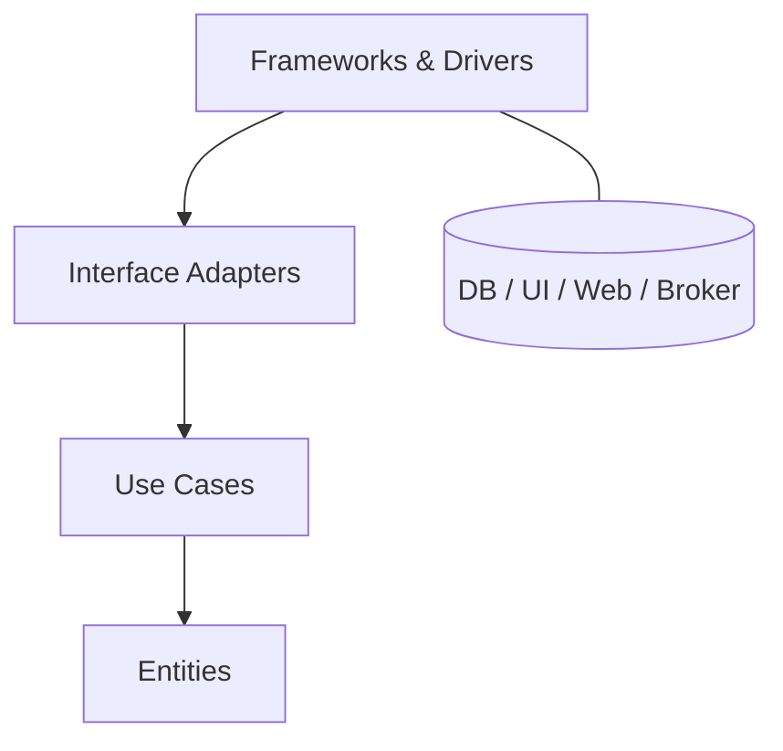

# Clean Architecture

## Mô tả
Clean Architecture là mô hình kiến trúc xoay quanh core business logic và áp dụng quy tắc phụ thuộc một chiều: code ở vòng trong không biết gì về vòng ngoài. Các vòng ngoài chỉ được phép phụ thuộc vào abstractions của vòng trong.

Kiến trúc này thường được mô tả bằng các vòng đồng tâm: Entities ở giữa, rồi Use Cases, rồi Interface Adapters, và ngoài cùng là Frameworks/Drivers.

## Ý tưởng cốt lõi
- Business rules là trung tâm của hệ thống.
- Dependencies luôn hướng vào trong.
- Framework, UI, DB, và external services chỉ là chi tiết kỹ thuật.
- Domain và use case phải test được mà không cần hạ tầng.

## Các vòng phổ biến
- Entities: business rules cốt lõi, invariants, quy tắc quan trọng nhất.
- Use Cases: application-specific business rules, orchestration.
- Interface Adapters: controller, presenter, gateway, mapper.
- Frameworks & Drivers: web framework, database, UI toolkit, message broker.

## Khi nào dùng
- Khi domain và use case quan trọng hơn hạ tầng.
- Khi cần khả năng thay đổi framework, DB, hoặc UI mà ít ảnh hưởng core.
- Khi muốn test core logic hoàn toàn độc lập.
- Khi hệ thống lớn và ranh giới giữa nghiệp vụ với kỹ thuật cần rõ ràng.

## Khi không nên dùng
- Khi hệ thống quá nhỏ, việc thêm nhiều abstraction chỉ làm nặng hơn.
- Khi team chưa quen quy tắc dependency inversion và dễ tổ chức sai.
- Khi domain quá đơn giản, layered architecture có thể đủ.

## Quy trình hoạt động
1. Framework hoặc UI nhận input.
2. Controller/adapter chuyển input thành request model.
3. Use case xử lý nghiệp vụ.
4. Use case gọi gateway/repository qua interface.
5. Presenter/adapter chuyển output thành response model.

## Diagram (Mermaid)


## Ví dụ (Python)
Ví dụ này mô tả use case tạo order với port và adapter.

```python
from dataclasses import dataclass
from abc import ABC, abstractmethod
from uuid import uuid4


@dataclass
class OrderRequest:
    customer_id: str
    amount: float


@dataclass
class OrderResponse:
    order_id: str
    status: str


class OrderRepositoryPort(ABC):
    @abstractmethod
    def save(self, order):
        pass


@dataclass
class Order:
    customer_id: str
    amount: float
    id: str = None

    def validate(self):
        if self.amount <= 0:
            raise ValueError("amount must be positive")


class CreateOrderUseCase:
    def __init__(self, repository: OrderRepositoryPort):
        self.repository = repository

    def execute(self, request: OrderRequest):
        order = Order(customer_id=request.customer_id, amount=request.amount)
        order.validate()
        order.id = str(uuid4())
        self.repository.save(order)
        return OrderResponse(order_id=order.id, status="created")


class InMemoryOrderRepository(OrderRepositoryPort):
    def __init__(self):
        self.orders = {}

    def save(self, order):
        self.orders[order.id] = order


class OrderController:
    def __init__(self, use_case: CreateOrderUseCase):
        self.use_case = use_case

    def post(self, payload):
        request = OrderRequest(**payload)
        response = self.use_case.execute(request)
        return {"order_id": response.order_id, "status": response.status}
```

### Giải thích ví dụ
- `Order` là entity/domain object.
- `CreateOrderUseCase` là application use case.
- `OrderRepositoryPort` là abstraction mà vòng trong định nghĩa.
- `InMemoryOrderRepository` là adapter/hạ tầng cụ thể.
- `OrderController` là interface adapter cho request/response.

## Ưu điểm
- Core business logic độc lập với framework.
- Test dễ hơn vì vòng trong không cần infrastructure thật.
- Thay đổi DB/UI/framework ít ảnh hưởng đến core.
- Ranh giới trách nhiệm rất rõ.

## Nhược điểm
- Nhiều lớp, nhiều interface, nhiều mapping.
- Chi phí thiết kế ban đầu cao hơn layered architecture.
- Nếu domain đơn giản, độ phức tạp có thể vượt nhu cầu.

## Pitfalls
- Cho framework code xâm nhập vào vòng trong.
- Dùng quá nhiều DTO và mapper nhưng không đem lại giá trị thật.
- Viết abstraction quá sớm, gây “architecture astronautics”.
- Không giữ dependency rule một cách nhất quán.

## Checklist
- [ ] Dependencies chỉ đi từ ngoài vào trong.
- [ ] Entities và use cases không import framework/DB code.
- [ ] Ports được định nghĩa ở core, adapters ở ngoài.
- [ ] Core test được bằng mock/fake.
- [ ] Request/response model tách khỏi domain model.

## Case study
- Một hệ thống billing có thể đặt core pricing, invoicing, và validation ở use cases/entities, còn API, DB, email, payment gateway đều là adapters.
- Khi thay payment provider, chỉ adapter thay đổi, core vẫn giữ nguyên.

## Phân biệt nhanh
- Layered Architecture tách theo tầng kỹ thuật và nghiệp vụ.
- Clean Architecture tập trung vào dependency rule và vòng đồng tâm.
- Hexagonal Architecture gần với Clean Architecture nhưng nhấn mạnh ports/adapters hơn.

## Tóm tắt ngắn
Clean Architecture phù hợp khi bạn muốn core business logic bền vững, test tốt, và giảm phụ thuộc vào chi tiết kỹ thuật bên ngoài.

---

Người soạn: ArchReview AI — Clean Architecture.