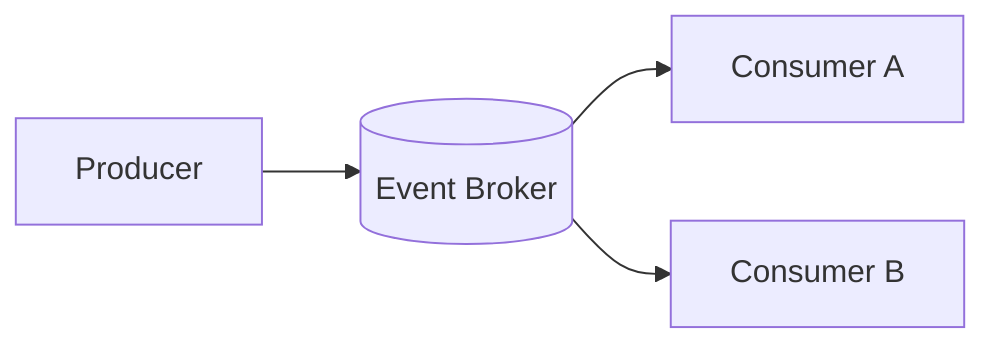

# Event-driven Architecture (EDA)

## Mô tả
EDA dựa trên sự kiện: các thành phần giao tiếp bằng cách phát và xử lý events (pub/sub).

## Kiểu phổ biến
- Pub/Sub (message broker)
- Event Sourcing (lưu toàn bộ lịch sử event)
- CQRS thường kết hợp với EDA

## Khi nào dùng
- Hệ thống cần high decoupling, phản ứng real-time, hoặc xử lý stream/async.

## Ưu/nhược
- Ưu: loose coupling, scalability, tốt cho pipeline xử lý dữ liệu.
- Nhược: khó debug, ordering/duplication, cần design idempotency và schema evolution.

## Checklist
- [ ] Dùng message broker phù hợp (Kafka, RabbitMQ...)
- [ ] Thiết kế event schema và versioning
- [ ] Xử lý duplicate events (idempotency)
- [ ] Quan tâm ordering và partitioning
- [ ] Giải pháp replay/retention nếu dùng event sourcing

## Diagram (Mermaid)


## Ví dụ (Kafka-style, pseudocode)
```python
# Producer
producer.send('orders', key=order.id, value=order.json())

# Consumer
for msg in consumer.subscribe('orders'):
    process_order_event(msg.value)
```

## Case study (ngắn)
- Hệ thống analytics: các service phát events cho hành vi người dùng; một consumer chịu trách nhiệm build materialized views cho dashboard.

## Design tips
- Thiết kế event schema (Avro/JSON Schema) và versioning.
- Xây idempotent consumers để an toàn khi retry.