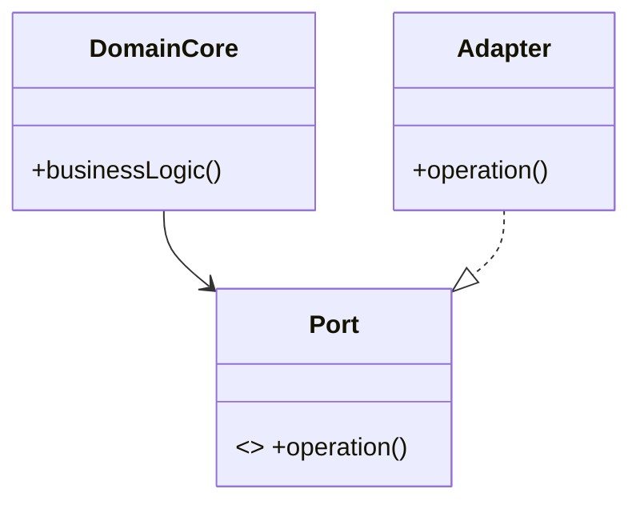

# Hexagonal Architecture (Ports & Adapters)

## Mô tả
Hexagonal (Ports & Adapters) tách core domain khỏi infrastructure bằng các ports (interfaces) và adapters (implementations). Core chỉ phụ thuộc vào abstractions.

## Khi nào dùng
- Muốn bảo vệ domain model khỏi framework/DB thay đổi.
- Cần test domain độc lập và dễ thay đổi cơ sở hạ tầng.

## Ưu/nhược
- Ưu: domain sạch, dễ test, thay đổi infra không ảnh hưởng domain.
- Nhược: có thể tăng số lớp/abstraction, cần cấu trúc rõ ràng.

## Checklist
- [ ] Domain core không import trực tiếp infra/DB/API.
- [ ] Định nghĩa ports (interfaces) rõ ràng cho giao tiếp ngoài.
- [ ] Adapters implement ports và được inject vào core.
- [ ] Viết unit tests cho core bằng mocks cho ports.

## Diagram (Mermaid)


## Ví dụ (Python — Ports & Adapters, tóm tắt)
```python
class EmailPort(ABC):
    @abstractmethod
    def send(self, to, body): pass

class SmtpAdapter(EmailPort):
    def send(self, to, body):
        # use smtplib
        pass

class NotificationService:
    def __init__(self, email_port: EmailPort):
        self.email = email_port
    def notify(self, user, msg):
        self.email.send(user.email, msg)

# At runtime: notify = NotificationService(SmtpAdapter())
```

## Case study (ngắn)
- Bảo vệ domain core của một billing system bằng ports cho storage, payment gateway, và notification; khi thay provider chỉ cần viết adapter mới.