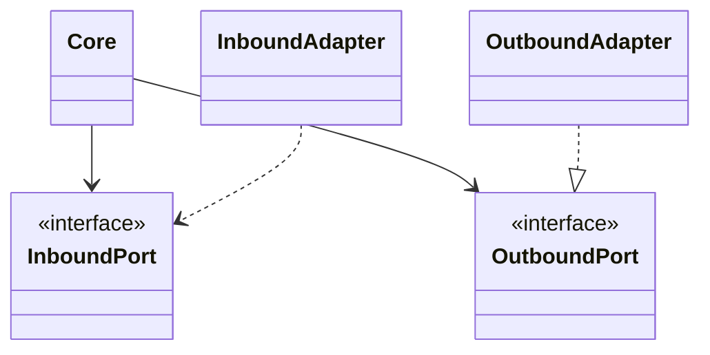

# Hexagonal Architecture (Ports & Adapters)

## Mô tả
Hexagonal Architecture, còn gọi là Ports & Adapters, tổ chức hệ thống sao cho core domain nằm ở giữa và mọi tương tác bên ngoài đi qua các ports (interfaces) và adapters (implementations). Mục tiêu là cô lập business logic khỏi framework, database, UI, và các hệ thống ngoài.

Kiến trúc này rất mạnh khi domain cần được bảo vệ khỏi thay đổi hạ tầng và khi bạn muốn core có thể chạy trong nhiều ngữ cảnh khác nhau: web, CLI, batch job, message consumer, hoặc test.

## Ý tưởng cốt lõi
- Core không phụ thuộc vào hạ tầng.
- Ports mô tả nhu cầu giao tiếp của core.
- Adapters biến đổi dữ liệu giữa core và thế giới bên ngoài.
- Cùng một core có thể được dùng bởi nhiều entry point khác nhau.

## Thành phần chính
- Domain/Core: business logic và quy tắc nghiệp vụ.
- Inbound ports: interface mà bên ngoài dùng để gọi vào core.
- Outbound ports: interface mà core dùng để gọi ra ngoài.
- Inbound adapters: controller, CLI, scheduler, message consumer.
- Outbound adapters: repository, email gateway, payment gateway, API client.

## Khi nào dùng
- Khi muốn domain thật sự độc lập với hạ tầng.
- Khi ứng dụng có nhiều kiểu entry point.
- Khi cần unit test core mà không cần DB hay HTTP server.
- Khi thay đổi infrastructure thường xuyên.

## Khi không nên dùng
- Khi ứng dụng quá nhỏ và các abstraction tạo thêm gánh nặng không cần thiết.
- Khi team chưa sẵn sàng duy trì nhiều interface và adapter.

## Quy trình hoạt động
1. Inbound adapter nhận request từ bên ngoài.
2. Adapter chuyển request thành input cho inbound port.
3. Use case/core xử lý nghiệp vụ.
4. Core gọi outbound port nếu cần.
5. Outbound adapter thực thi chi tiết kỹ thuật.

## Diagram (Mermaid)


## Ví dụ (Python)
Ví dụ này mô tả một use case gửi thông báo qua port email.

```python
from abc import ABC, abstractmethod
from dataclasses import dataclass


@dataclass
class NotificationRequest:
    to: str
    message: str


class EmailPort(ABC):
    @abstractmethod
    def send(self, to, body):
        pass


class SendNotificationUseCase:
    def __init__(self, email_port: EmailPort):
        self.email_port = email_port

    def execute(self, request: NotificationRequest):
        if not request.to or not request.message:
            raise ValueError("invalid notification request")
        self.email_port.send(request.to, request.message)
        return {"status": "sent"}


class SmtpEmailAdapter(EmailPort):
    def send(self, to, body):
        return f"SMTP send to {to}: {body}"


class NotificationController:
    def __init__(self, use_case: SendNotificationUseCase):
        self.use_case = use_case

    def post(self, payload):
        request = NotificationRequest(**payload)
        return self.use_case.execute(request)
```

### Giải thích ví dụ
- `SendNotificationUseCase` là core logic.
- `EmailPort` là outbound port mà core định nghĩa.
- `SmtpEmailAdapter` là outbound adapter cụ thể.
- `NotificationController` là inbound adapter.

## Ưu điểm
- Core domain cực kỳ sạch.
- Dễ thay đổi DB, queue, email provider, hoặc UI.
- Test core rất đơn giản.
- Hỗ trợ nhiều entry point mà vẫn dùng chung core.

## Nhược điểm
- Tăng số lượng abstraction.
- Có thể khó hiểu hơn layered architecture với người mới.
- Nếu thiết kế ports không khéo, hệ thống trở nên rườm rà.

## Pitfalls
- Định nghĩa port quá chi tiết theo công nghệ thay vì theo nhu cầu business.
- Để adapter chứa logic nghiệp vụ.
- Cho core gọi trực tiếp framework hoặc client bên ngoài.
- Không giữ ranh giới inbound/outbound rõ ràng.

## Checklist
- [ ] Core không import infrastructure code.
- [ ] Inbound và outbound ports được định nghĩa rõ.
- [ ] Adapter là lớp chuyển đổi, không phải nơi chứa business logic chính.
- [ ] Core test được độc lập bằng fake/mock ports.

## Case study
- Một hệ thống đặt hàng có thể có REST API, CLI import đơn hàng, và consumer xử lý message cùng gọi vào một core use case.
- Khi đổi email provider từ SMTP sang API service, chỉ outbound adapter thay đổi.

## Phân biệt nhanh
- Hexagonal Architecture nhấn mạnh ports/adapters và nhiều entry point.
- Clean Architecture nhấn mạnh vòng đồng tâm và dependency rule.
- Layered Architecture nhấn mạnh tầng trách nhiệm.

## Tóm tắt ngắn
Hexagonal Architecture giúp core business logic đứng vững trước thay đổi hạ tầng và hỗ trợ nhiều cách tương tác vào/ra hệ thống.

---

Người soạn: ArchReview AI — Hexagonal Architecture.