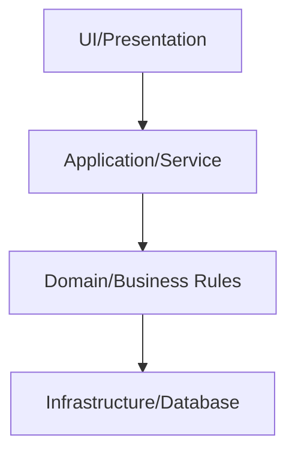

# Layered (N-tier) Architecture

## Mô tả
Kiến trúc phân lớp (presentation, application/service, domain, data) là mô hình cổ điển tách trách nhiệm theo layers. Mỗi layer chỉ tương tác với layer kế dưới.

## Khi nào dùng
- Ứng dụng CRUD truyền thống, hệ thống doanh nghiệp.
- Khi cần tách rõ trách nhiệm và đơn giản hóa phát triển.

## Ưu/nhược
- Ưu: rõ ràng, dễ hiểu, dễ test từng lớp, phù hợp đội nhỏ.
- Nhược: có thể dẫn đến coupling giữa layers, khó mở rộng khi hệ thống lớn, hiệu năng khi qua nhiều layer.

## Checklist triển khai
- [ ] Xác định rõ các layer (UI, Application, Domain, Infrastructure).
- [ ] Chỉ cho phép giao tiếp giữa các layer liền kề.
- [ ] Domain layer không phụ thuộc vào framework/DB.
- [ ] Có contract/interface giữa layer để dễ mock/test.

## Ví dụ (tóm tắt)
- Presentation: REST controllers / UI
- Application: services orchestration
- Domain: domain models, business rules
- Infrastructure: repository, DB, external APIs

## Diagram (Mermaid)


## Ví dụ code (Python, tóm tắt)
```python
# Presentation: Flask route
@app.route('/orders', methods=['POST'])
def create_order():
    data = request.json
    return order_service.create_order(data)

# Application/Service
class OrderService:
    def __init__(self, repo, validator):
        self.repo = repo
        self.validator = validator
    def create_order(self, data):
        order = Order.from_dict(data)
        self.validator.validate(order)
        self.repo.save(order)
        return {'id': order.id}

# Infrastructure: repository implementation
class SqlOrderRepo:
    def save(self, order):
        # persist to DB
        pass
```

## Case study (ngắn)
- Dự án e-commerce nhỏ: bắt đầu với layered architecture để tách rõ presentation và business; khi cần scale, có thể extract một số application services thành microservices.