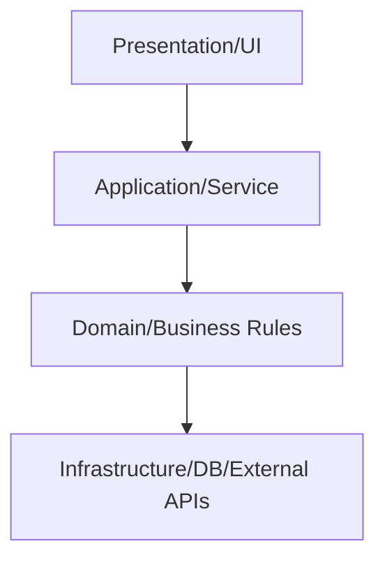

# Layered Architecture

## Mô tả
Layered Architecture là mô hình tổ chức hệ thống theo các lớp có trách nhiệm rõ ràng, thường gồm Presentation, Application, Domain, và Infrastructure. Mỗi lớp chỉ nên phụ thuộc vào lớp kế cận theo quy tắc đã định, giúp luồng xử lý trở nên dễ hiểu và dễ kiểm soát.

Đây là một trong những kiến trúc phổ biến nhất cho ứng dụng doanh nghiệp, hệ thống CRUD, và các sản phẩm cần team nhỏ đến trung bình phát triển nhanh nhưng vẫn muốn giữ cấu trúc rõ ràng.

## Ý tưởng cốt lõi
- Tách trách nhiệm theo từng lớp.
- Giảm độ phức tạp bằng cách giới hạn phạm vi phụ thuộc.
- Giữ business rules ở lớp gần domain nhất.
- Dễ thay thế UI, DB, hoặc framework mà ít ảnh hưởng các lớp còn lại.

## Các lớp thường gặp
- Presentation layer: controller, API, UI, view model, request/response mapping.
- Application layer: orchestration, use case, transaction boundary, gọi repository/service.
- Domain layer: entity, value object, business rules, invariants.
- Infrastructure layer: database, external API, message broker, file system.

## Khi nào dùng
- Ứng dụng CRUD, back-office, ERP, hệ thống nội bộ.
- Khi team muốn có kiến trúc dễ hiểu và onboarding nhanh.
- Khi domain chưa quá phức tạp nhưng vẫn cần ranh giới rõ ràng.
- Khi cần tách UI, business logic, và persistence để dễ test hơn.

## Khi không nên dùng
- Khi domain phức tạp đến mức các lớp dễ bị “anemic” và logic bị dàn mỏng.
- Khi mọi use case đều phụ thuộc trực tiếp qua nhiều lớp trung gian, làm luồng xử lý chậm và cứng.
- Khi hệ thống cần khả năng thay đổi hạ tầng rất mạnh, Hexagonal hoặc Clean Architecture có thể phù hợp hơn.

## Quy trình hoạt động
1. Presentation nhận request từ người dùng hoặc API.
2. Application layer điều phối use case.
3. Domain layer thực thi luật nghiệp vụ.
4. Infrastructure layer lưu trữ hoặc gọi hệ thống ngoài.
5. Kết quả được trả ngược lên Presentation.

## Diagram (Mermaid)


## Ví dụ (Python)
Ví dụ này mô tả luồng tạo đơn hàng qua controller, service, domain, và repository.

```python
from dataclasses import dataclass, field
from uuid import uuid4


@dataclass
class OrderLine:
    sku: str
    quantity: int
    unit_price: float

    @property
    def subtotal(self):
        return self.quantity * self.unit_price


@dataclass
class Order:
    customer_id: str
    lines: list[OrderLine] = field(default_factory=list)
    id: str = field(default_factory=lambda: str(uuid4()))

    def total(self):
        return sum(line.subtotal for line in self.lines)

    def validate(self):
        if not self.lines:
            raise ValueError("Order must have at least one line")
        if self.total() <= 0:
            raise ValueError("Order total must be positive")


class OrderRepository:
    def save(self, order):
        self._storage = getattr(self, "_storage", {})
        self._storage[order.id] = order
        return order.id


class OrderService:
    def __init__(self, repository):
        self.repository = repository

    def create_order(self, customer_id, lines_data):
        lines = [OrderLine(**item) for item in lines_data]
        order = Order(customer_id=customer_id, lines=lines)
        order.validate()
        order_id = self.repository.save(order)
        return {"order_id": order_id, "total": order.total()}


class OrderController:
    def __init__(self, service):
        self.service = service

    def post(self, request_body):
        return self.service.create_order(
            request_body["customer_id"],
            request_body["lines"],
        )
```

### Giải thích ví dụ
- `OrderController` đại diện cho Presentation layer.
- `OrderService` là Application layer, điều phối luồng tạo đơn.
- `Order` và `OrderLine` là Domain layer.
- `OrderRepository` là Infrastructure layer.

## Ưu điểm
- Dễ hiểu, dễ học, dễ onboarding.
- Phân tách trách nhiệm rõ ràng.
- Dễ test từng lớp riêng biệt.
- Phù hợp với team nhỏ hoặc hệ thống ít biến động.

## Nhược điểm
- Có thể tạo ra nhiều lớp trung gian không cần thiết.
- Nếu lạm dụng, domain logic dễ bị đẩy lên service layer và thành anemic model.
- Với hệ thống lớn, coupling giữa các lớp vẫn có thể tăng dần.

## Pitfalls
- Để mọi logic nằm trong service khiến domain chỉ còn data container.
- Cho Presentation phụ thuộc trực tiếp vào Infrastructure.
- Phụ thuộc ngược giữa các lớp khiến kiến trúc khó kiểm soát.
- Dùng quá nhiều DTO mapping không cần thiết.

## Checklist
- [ ] Mỗi lớp có trách nhiệm rõ ràng.
- [ ] Presentation không chứa business rules.
- [ ] Domain không phụ thuộc framework hoặc DB.
- [ ] Infrastructure được cô lập ở rìa hệ thống.
- [ ] Luồng gọi giữa các lớp được kiểm soát và dễ đọc.

## Case study
- Hệ thống bán hàng nội bộ thường bắt đầu rất tốt với layered architecture: UI gọi service, service gọi repository, domain giữ luật tính tiền và kiểm tra đơn hàng.
- Khi hệ thống phức tạp hơn, một số use case có thể được tách ra thành microservice hoặc chuyển dần sang Hexagonal/Clean Architecture.

## Tóm tắt ngắn
Layered Architecture phù hợp khi bạn cần cấu trúc rõ ràng, dễ hiểu, dễ triển khai, và muốn giữ chi phí tổ chức hệ thống ở mức thấp.

---

Người soạn: ArchReview AI — Layered Architecture.