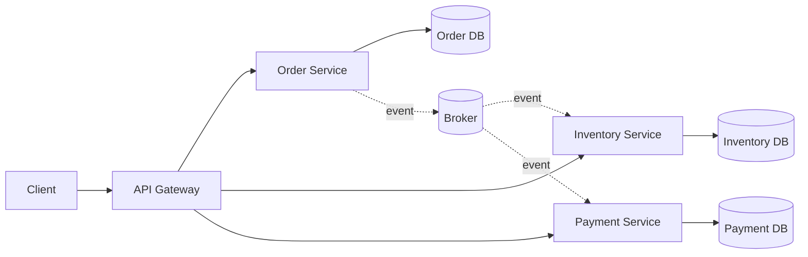

# Microservice Architecture

## Mô tả
Microservice Architecture chia hệ thống thành nhiều service nhỏ, độc lập, mỗi service chịu trách nhiệm cho một bounded context cụ thể và có thể deploy, scale, và phát triển riêng.

Mỗi service nên có dữ liệu riêng, contract riêng, và vòng đời triển khai riêng. Đây không chỉ là chia code thành nhiều project, mà là tách hệ thống thành các đơn vị vận hành độc lập.

## Ý tưởng cốt lõi
- Mỗi service sở hữu một phạm vi nghiệp vụ rõ ràng.
- Service giao tiếp qua API hoặc event.
- Deployment và scaling tách biệt.
- Mỗi service nên tự chủ càng nhiều càng tốt.

## Thành phần thường gặp
- API Gateway: entry point cho client.
- Service discovery: tìm địa chỉ service.
- Independent services: các service độc lập theo domain.
- Database per service: mỗi service sở hữu dữ liệu riêng.
- Message broker: hỗ trợ giao tiếp bất đồng bộ.
- Observability stack: logging, tracing, metrics.

## Khi nào dùng
- Hệ thống lớn, domain tách được rõ ràng.
- Nhiều team phát triển độc lập.
- Cần scale từng phần của hệ thống theo tải thực tế.
- Cần deploy riêng từng chức năng mà không dừng toàn hệ thống.

## Khi không nên dùng
- Khi hệ thống còn nhỏ hoặc domain chưa rõ ràng.
- Khi team chưa có năng lực vận hành distributed systems.
- Khi yêu cầu consistency mạnh hơn khả năng của mô hình phân tán.

## Quy trình hoạt động
1. Client gọi API Gateway hoặc trực tiếp vào service phù hợp.
2. Service xử lý nghiệp vụ trong bounded context của nó.
3. Nếu cần, service gọi service khác qua REST/gRPC/event.
4. Dữ liệu được lưu cục bộ trong database riêng.
5. Hệ thống giám sát trạng thái qua logs, metrics, traces.

## Diagram (Mermaid)


## Ví dụ (Python)
Ví dụ mô tả giao tiếp giữa Order Service và Inventory Service qua event.

```python
class OrderService:
    def __init__(self, event_bus):
        self.event_bus = event_bus

    def create_order(self, order_id, items):
        order = {"order_id": order_id, "items": items, "status": "created"}
        self.event_bus.publish("OrderCreated", order)
        return order


class InventoryService:
    def __init__(self):
        self.reservations = []

    def on_order_created(self, event):
        for item in event["items"]:
            self.reservations.append({"order_id": event["order_id"], **item})
        return {"status": "reserved"}


class InMemoryEventBus:
    def __init__(self):
        self.handlers = {}

    def subscribe(self, event_name, handler):
        self.handlers.setdefault(event_name, []).append(handler)

    def publish(self, event_name, payload):
        for handler in self.handlers.get(event_name, []):
            handler(payload)
```

### Giải thích ví dụ
- `OrderService` phát event thay vì gọi trực tiếp logic nội bộ của service khác.
- `InventoryService` phản ứng với event.
- `InMemoryEventBus` mô phỏng message broker.

## Ưu điểm
- Deploy và scale độc lập.
- Fault isolation tốt hơn monolith trong nhiều trường hợp.
- Dễ tổ chức theo bounded context.
- Mỗi team có thể sở hữu service riêng.

## Nhược điểm
- Tăng mạnh độ phức tạp vận hành.
- Giao tiếp mạng gây latency và lỗi phân tán.
- Consistency và transaction khó hơn.
- Debug và tracing phức tạp hơn rất nhiều so với monolith.

## Pitfalls
- Chia service quá nhỏ nhưng không có ranh giới domain rõ ràng.
- Dùng distributed transaction một cách ngây thơ.
- Không đầu tư observability, dẫn đến khó debug production.
- Tạo coupling qua shared database hoặc shared library nặng.

## Checklist
- [ ] Service có bounded context rõ ràng.
- [ ] Mỗi service sở hữu dữ liệu của mình.
- [ ] Có chiến lược observability đầy đủ.
- [ ] Có cơ chế xử lý lỗi mạng và retry phù hợp.
- [ ] API contract được version hóa và backward compatible.

## Operational notes
- Cần CI/CD cho từng service.
- Cần health checks, rate limiting, circuit breaker, timeout, retry, tracing.
- Event-driven integration thường hữu ích cho các luồng không cần đồng bộ tức thì.
- Dùng saga hoặc choreography khi cần xử lý workflow nhiều service.

## Case study
- Marketplace: tách Order Service, Inventory Service, Payment Service, Notification Service.
- Order được tạo ở service này, payment và inventory phản ứng theo event để hoàn thành workflow.

## Phân biệt nhanh
- Microservices tập trung vào tách hệ thống thành service độc lập.
- Monolithic giữ mọi thứ trong một deployable unit.
- Event-driven là kiểu giao tiếp, không phải bản thân cấu trúc service.

## Tóm tắt ngắn
Microservice Architecture phù hợp khi hệ thống đủ lớn và team đủ mạnh để chấp nhận sự đánh đổi giữa autonomy và độ phức tạp vận hành.

---

Người soạn: ArchReview AI — Microservice Architecture.