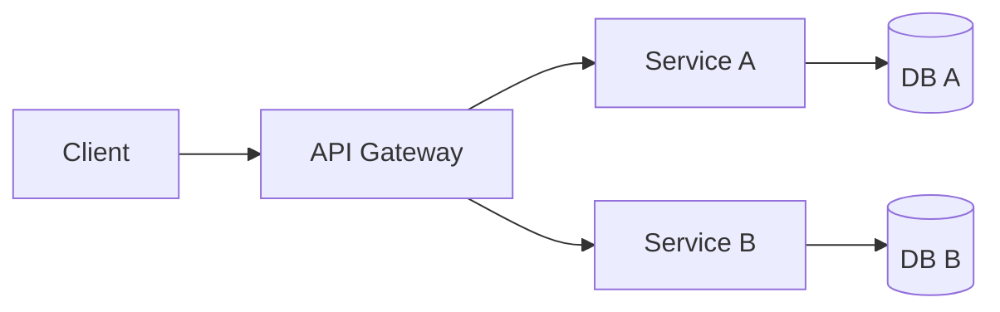

# Microservices Architecture

## Mô tả
Microservices chia hệ thống thành nhiều dịch vụ nhỏ, độc lập, triển khai và scale riêng rẽ, mỗi service quản lý dữ liệu riêng.

## Khi nào dùng
- Hệ thống lớn, cần scale độc lập từng chức năng.
- Team phân tán, muốn deploy độc lập.

## Ưu/nhược
- Ưu: độc lập deploy, scale, fault isolation, tổ chức theo bounded contexts.
- Nhược: phức tạp (distributed systems), yêu cầu DevOps, giao tiếp giữa services, transactional consistency khó hơn.

## Pitfalls & Best practices
- Thiết kế contract REST/gRPC rõ ràng.
- Giải quyết observability: tracing, logging, metrics.
- Dùng API Gateway, service discovery, circuit breaker.
- Suy nghĩ về dữ liệu: tránh distributed transactions, dùng eventual consistency.

## Checklist
- [ ] Mỗi service có bounded context rõ ràng?
- [ ] Có chiến lược deployment & CI/CD cho từng service?
- [ ] Observability: tracing, logging, metrics?
- [ ] Cơ chế xử lý lỗi mạng: retries, circuit breakers?
- [ ] Versioning API và backward compatibility?

## Diagram (Mermaid)


## Ví dụ (giao tiếp giữa services) - tóm tắt
```
// Service A exposes REST API
POST /orders -> creates order, emits event OrderCreated

// Service B subscribes to OrderCreated
on OrderCreated -> reserve inventory
```

## Case study (ngắn)
- Ứng dụng marketplace: tách Order Service, Inventory Service, Payment Service. Order Service phát events, Inventory & Payment xử lý bất đồng bộ. Sử dụng saga/choreography để đảm bảo consistency.

## Operational notes
- Cần CI/CD per-service, health checks, circuit breakers, and centralized logging/tracing (OpenTelemetry).