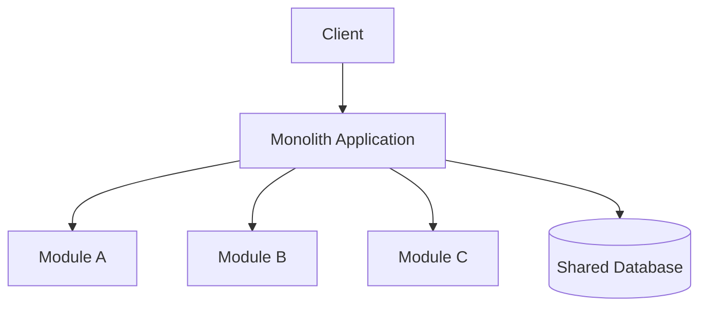

# Monolithic Architecture

## Mô tả
Monolithic Architecture gói toàn bộ ứng dụng vào một codebase và thường được deploy như một đơn vị duy nhất. Các module bên trong có thể được tổ chức tốt hoặc xấu, nhưng điểm nhận diện cốt lõi là vẫn chỉ có một deployable unit.

Monolith không đồng nghĩa với kiến trúc kém. Một modular monolith được thiết kế tốt có thể rất mạnh, dễ triển khai, và là lựa chọn hợp lý cho nhiều sản phẩm ở giai đoạn đầu hoặc trung bình.

## Ý tưởng cốt lõi
- Một deployable unit duy nhất.
- Dễ triển khai và vận hành hơn distributed systems.
- Có thể tổ chức module nội bộ rất chặt chẽ.
- Khi cần, có thể tách dần thành service nhỏ hơn.

## Biến thể
- Simple monolith: codebase lớn, module lỏng lẻo.
- Modular monolith: chia module rõ ràng, boundary nội bộ tốt.
- Monolith with layered/modules: tổ chức theo domain hoặc layer.

## Khi nào dùng
- Sản phẩm giai đoạn đầu.
- Team nhỏ hoặc vừa.
- Cần tốc độ phát triển và triển khai nhanh.
- Domain chưa đủ phức tạp để trả giá cho microservices.

## Khi không nên dùng
- Khi một phần nhỏ của hệ thống phải scale cực mạnh trong khi phần còn lại không cần.
- Khi team rất lớn và một codebase duy nhất gây xung đột quá nhiều.

## Quy trình hoạt động
1. Người dùng gọi vào ứng dụng.
2. Request đi qua một runtime duy nhất.
3. Module bên trong xử lý logic.
4. Dữ liệu thường dùng chung một database hoặc cùng một deployable data store.
5. Ứng dụng được build và deploy như một đơn vị.

## Diagram (Mermaid)


## Ví dụ (Python)
Ví dụ này mô phỏng monolith được chia thành module nội bộ theo domain.

```python
class CustomerModule:
    def create_customer(self, name):
        return {"id": 1, "name": name}


class OrderModule:
    def create_order(self, customer_id, items):
        return {"id": 100, "customer_id": customer_id, "items": items}


class BillingModule:
    def invoice(self, order):
        return {"order_id": order["id"], "status": "invoiced"}


class Application:
    def __init__(self):
        self.customers = CustomerModule()
        self.orders = OrderModule()
        self.billing = BillingModule()

    def checkout(self, customer_name, items):
        customer = self.customers.create_customer(customer_name)
        order = self.orders.create_order(customer["id"], items)
        invoice = self.billing.invoice(order)
        return {"customer": customer, "order": order, "invoice": invoice}
```

### Giải thích ví dụ
- Toàn bộ chức năng nằm trong một application.
- Các module nội bộ vẫn được tách rõ theo trách nhiệm.
- Đây là ví dụ của modular monolith, không phải code sprawl.

## Ưu điểm
- Đơn giản để build, test, và deploy.
- Giao tiếp nội bộ nhanh, không có network overhead.
- Transaction và consistency dễ hơn microservices.
- Phù hợp với đội nhỏ và tốc độ phát triển cao.

## Nhược điểm
- Một bug nghiêm trọng có thể ảnh hưởng toàn hệ thống.
- Deploy thay đổi nhỏ vẫn có thể phải deploy cả ứng dụng.
- Khi codebase quá lớn, việc kiểm soát boundary nội bộ trở nên khó hơn.

## Pitfalls
- Monolith nhưng không có module boundary, biến thành “big ball of mud”.
- Shared database access quá tự do giữa module.
- Thiếu kỷ luật module khiến tách service sau này rất khó.

## Checklist
- [ ] Module nội bộ có boundary rõ.
- [ ] Không để các module gọi lung tung qua lại.
- [ ] Có thể deploy toàn bộ hệ thống như một unit.
- [ ] Có chiến lược tách module nếu hệ thống tăng trưởng.

## Case study
- Một startup thường bắt đầu với modular monolith để phát triển nhanh.
- Khi một module như checkout hoặc search tăng trưởng quá mạnh, có thể tách nó thành service riêng sau này.

## Phân biệt nhanh
- Monolith đơn giản hơn để vận hành.
- Microservices linh hoạt hơn về scale và autonomy nhưng phức tạp hơn nhiều.
- Modular monolith là điểm cân bằng tốt giữa hai thái cực.

## Tóm tắt ngắn
Monolithic Architecture là lựa chọn hợp lý khi bạn ưu tiên tốc độ, tính đơn giản, và độ ổn định vận hành hơn là tách biệt deploy ở mức service.

---

Người soạn: ArchReview AI — Monolithic Architecture.