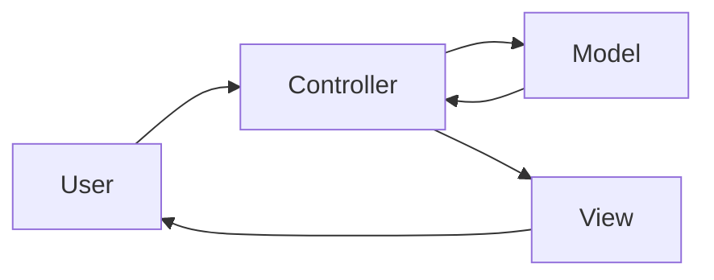

# MVC (Model-View-Controller)

## Mô tả
MVC là mô hình kiến trúc tách ứng dụng thành ba phần: Model, View, và Controller. Mục tiêu là chia rõ trách nhiệm giữa dữ liệu/nghiệp vụ, giao diện, và luồng điều khiển.

MVC được dùng rộng rãi trong web application, desktop application, và các hệ thống có vòng đời request/response rõ ràng.

## Ý tưởng cốt lõi
- Model quản lý dữ liệu và nghiệp vụ liên quan.
- View chịu trách nhiệm hiển thị.
- Controller nhận input, điều phối Model, rồi chọn View phù hợp.
- Giảm trộn lẫn logic giao diện và logic nghiệp vụ.

## Thành phần
- Model: domain data, business rules, state.
- View: template, UI, rendering.
- Controller: request handler, input validation, orchestration.

## Khi nào dùng
- Web app, admin panel, CRUD system.
- Khi cần phân tách rõ input handling và rendering.
- Khi team muốn kiến trúc phổ biến, dễ tuyển dụng, dễ onboard.

## Khi không nên dùng
- Khi UI logic phức tạp hơn nhiều so với bản chất MVC cổ điển.
- Khi data binding hai chiều hoặc reactive UI phù hợp hơn.
- Khi domain logic cần được bảo vệ chặt hơn, Clean/Hexagonal có thể tốt hơn.

## Quy trình hoạt động
1. User gửi request hoặc tương tác UI.
2. Controller nhận input.
3. Controller gọi model/service.
4. Model xử lý dữ liệu và nghiệp vụ.
5. Controller chọn view hoặc trả response.

## Diagram (Mermaid)


## Ví dụ (Python)
Ví dụ này mô phỏng một route tạo hồ sơ người dùng.

```python
from dataclasses import dataclass


@dataclass
class User:
    name: str
    email: str


class UserModel:
    def __init__(self):
        self.users = []

    def create_user(self, name, email):
        user = User(name=name, email=email)
        self.users.append(user)
        return user


class UserView:
    def render(self, user):
        return {"name": user.name, "email": user.email}


class UserController:
    def __init__(self, model, view):
        self.model = model
        self.view = view

    def create(self, request_data):
        user = self.model.create_user(request_data["name"], request_data["email"])
        return self.view.render(user)
```

### Giải thích ví dụ
- `UserModel` giữ dữ liệu và logic tạo user.
- `UserView` lo việc trình bày.
- `UserController` điều phối request và response.

## Ưu điểm
- Dễ hiểu, rất phổ biến.
- Tách input, processing, và presentation khá rõ.
- Phù hợp nhiều framework web truyền thống.

## Nhược điểm
- Dễ bị “fat controller” nếu đẩy quá nhiều logic vào controller.
- Nếu model quá mỏng, logic nghiệp vụ có thể bị phân tán.
- Với UI hiện đại, MVC cổ điển không luôn là mô hình phù hợp nhất.

## Pitfalls
- Controller chứa business rules thay vì chỉ điều phối.
- View truy cập dữ liệu trực tiếp theo cách làm rối kiến trúc.
- Model bị biến thành data container thuần túy mà không có behavior.

## Checklist
- [ ] Controller chỉ điều phối, không ôm logic nghiệp vụ nặng.
- [ ] View chỉ lo hiển thị.
- [ ] Model giữ dữ liệu và quy tắc liên quan.
- [ ] Có ranh giới rõ giữa request handling và rendering.

## Case study
- Một admin portal quản lý sản phẩm có thể dùng MVC rất tốt: controller xử lý request, model xử lý trạng thái sản phẩm, view render trang quản trị.

## Tóm tắt ngắn
MVC phù hợp khi bạn cần tách rõ input, hiển thị, và xử lý dữ liệu trong các ứng dụng giao diện hoặc web truyền thống.

---

Người soạn: ArchReview AI — MVC.