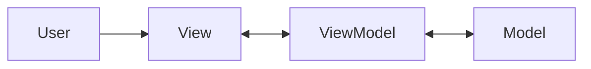

# MVVM (Model-View-ViewModel)

## Mô tả
MVVM tách giao diện người dùng thành Model, View, và ViewModel. ViewModel đóng vai trò trung gian giữa View và Model, thường cung cấp dữ liệu đã chuẩn hóa, trạng thái hiển thị, và các command cho UI.

MVVM đặc biệt phổ biến trong ứng dụng desktop và mobile có data binding mạnh, ví dụ WPF, Xamarin, .NET MAUI, và các framework UI tương tự.

## Ý tưởng cốt lõi
- Model giữ dữ liệu và business rules.
- View hiển thị và binding dữ liệu.
- ViewModel chuyển đổi dữ liệu thành dạng phù hợp cho View.
- Giảm logic hiển thị nằm trực tiếp trong View.

## Thành phần
- Model: domain data và nghiệp vụ.
- View: giao diện, binding, hiển thị.
- ViewModel: presentation state, commands, formatting, validation hỗ trợ UI.

## Khi nào dùng
- UI phức tạp và có data binding.
- Cần unit test logic hiển thị mà không cần render UI thật.
- Khi muốn tách xử lý trạng thái khỏi View.

## Khi không nên dùng
- Khi UI cực kỳ đơn giản, MVVM có thể quá nặng.
- Khi framework không hỗ trợ binding tốt, chi phí triển khai tăng.

## Quy trình hoạt động
1. User tương tác với View.
2. View cập nhật hoặc gọi command trên ViewModel.
3. ViewModel thay đổi state hoặc gọi Model.
4. View nhận cập nhật thông qua binding/notification.

## Diagram (Mermaid)


## Ví dụ (Python)
Ví dụ này mô phỏng ViewModel tính tổng và cung cấp state cho View.

```python
class OrderModel:
    def __init__(self, items):
        self.items = items

    def total(self):
        return sum(item["price"] * item["quantity"] for item in self.items)


class OrderViewModel:
    def __init__(self, model):
        self.model = model

    @property
    def item_count(self):
        return sum(item["quantity"] for item in self.model.items)

    @property
    def total_text(self):
        return f"Total: {self.model.total():.2f}"

    def add_item(self, name, price, quantity):
        self.model.items.append({"name": name, "price": price, "quantity": quantity})


class OrderView:
    def __init__(self, view_model):
        self.vm = view_model

    def render(self):
        return {
            "items": self.vm.item_count,
            "summary": self.vm.total_text,
        }
```

### Giải thích ví dụ
- `OrderModel` giữ dữ liệu gốc.
- `OrderViewModel` chuyển dữ liệu sang dạng phù hợp cho View.
- `OrderView` chỉ render state đã được chuẩn hóa.

## Ưu điểm
- Logic trình bày được test độc lập.
- View mỏng hơn, ít code xử lý trạng thái.
- Phù hợp với data binding và reactive UI.

## Nhược điểm
- Có thể tạo thêm lớp trung gian và state mapping.
- Nếu làm quá tay, ViewModel phình to thành “god object”.
- Cần framework hỗ trợ tốt để phát huy hết lợi ích.

## Pitfalls
- Đẩy business logic thật vào ViewModel thay vì Model hoặc domain service.
- Cho View truy cập model trực tiếp, phá vỡ mục tiêu tách lớp.
- ViewModel quá dính với UI framework nên khó test.

## Checklist
- [ ] View chỉ lo hiển thị và binding.
- [ ] ViewModel giữ logic hiển thị và command của UI.
- [ ] Model không phụ thuộc View/ViewModel.
- [ ] Logic nghiệp vụ cốt lõi không bị nhét vào ViewModel.

## Case study
- Một ứng dụng quản lý công việc có thể dùng MVVM để tính số lượng task, lọc danh sách, và render trạng thái mà không đụng trực tiếp vào model từ UI.

## Tóm tắt ngắn
MVVM phù hợp khi bạn cần UI có binding mạnh và muốn giữ View mỏng, còn logic trình bày nằm trong ViewModel.

---

Người soạn: ArchReview AI — MVVM.