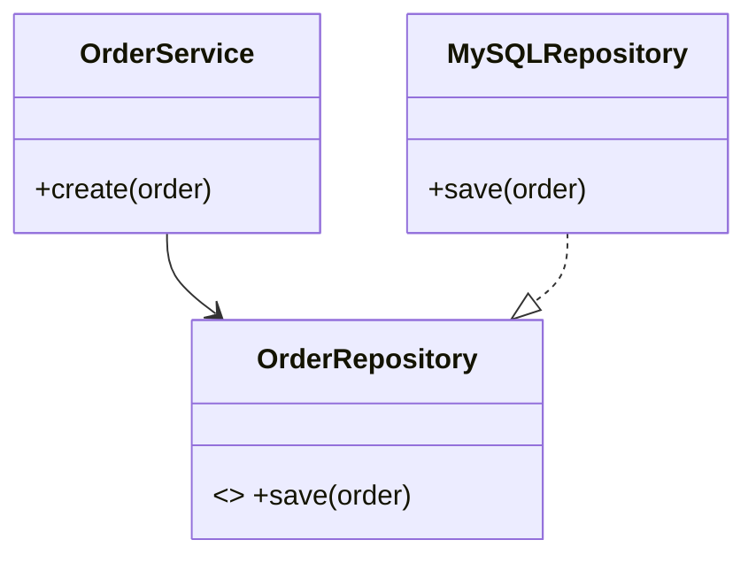

(The file `d:\Python\AI_RAG\ArchReview AI\knowledge_base\SOLID\dip.md` exists, but is empty)
### `01_SOLID/dip.md`

# Dependency Inversion Principle (DIP) - Nguyên lý Đảo ngược phụ thuộc

## Tổng quan
DIP phát biểu rằng: các module cấp cao không nên phụ thuộc trực tiếp vào module cấp thấp; cả hai nên phụ thuộc vào abstraction (giao diện/abstract). Ngoài ra, abstraction không nên phụ thuộc vào chi tiết; chi tiết nên phụ thuộc vào abstraction.

Mục tiêu: giảm coupling giữa high-level và low-level, tăng khả năng thay đổi và test.

## Dấu hiệu vi phạm
- High-level module trực tiếp khởi tạo hay gọi chi tiết implement của low-level module.
- Khó mock/replace dependency trong unit test.

## Cách áp dụng
- Định nghĩa interface/abstraction cho dependency.
- Inject dependency qua constructor, setter hoặc sử dụng DI container.
- Low-level modules implement abstraction.

## Ví dụ — Sai (vi phạm DIP) — Python
```python
class MySQLRepository:
	def save(self, data): pass

class OrderService:
	def __init__(self):
		self.repo = MySQLRepository()  # trực tiếp phụ thuộc vào chi tiết

	def create(self, order):
		self.repo.save(order)
```

Vấn đề: không thể thay `MySQLRepository` bằng mock hoặc repository khác mà không sửa `OrderService`.

## Ví dụ — Đúng (tuân DIP) — Python
```python
from abc import ABC, abstractmethod

class OrderRepository(ABC):
	@abstractmethod
	def save(self, order): pass

class MySQLRepository(OrderRepository):
	def save(self, order): pass

class OrderService:
	def __init__(self, repo: OrderRepository):
		self.repo = repo
	def create(self, order):
		self.repo.save(order)

# Khi chạy: service = OrderService(MySQLRepository())
# Khi test: service = OrderService(MockRepository())
```

## Ví dụ Java với DI
```java
public interface OrderRepository { void save(Order o); }
public class MySQLRepository implements OrderRepository { public void save(Order o) { /*...*/ } }

public class OrderService {
	private final OrderRepository repo;
	public OrderService(OrderRepository repo) { this.repo = repo; }
}

// Sử dụng DI container hoặc cấu hình tay để inject
```

## Checklist DIP
- [ ] High-level module phụ thuộc vào abstraction chứ không phải chi tiết?
- [ ] Có thể inject dependency khi chạy và khi test?
- [ ] Chi tiết implement implement abstraction, không ngược lại?

## Lưu ý
- DIP thường phối hợp với Factory/DI container để cấu hình cuộc đời đối tượng.
- Tránh over-abstraction — tạo abstraction khi có lợi cho test và mở rộng.

## UML (Mermaid)


---

Người soạn: ArchReview AI — DIP chi tiết.

