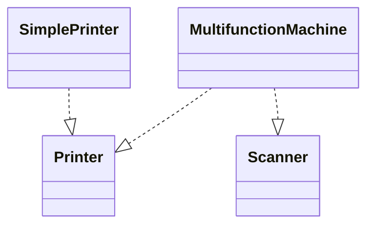

(The file `d:\Python\AI_RAG\ArchReview AI\knowledge_base\SOLID\isp.md` exists, but is empty)
### `01_SOLID/isp.md`

# Interface Segregation Principle (ISP) - Nguyên lý Phân tách Giao diện

## Tổng quan
ISP nói rằng: khách hàng (client) không nên bị ép phụ thuộc vào các interface mà họ không sử dụng. Thay vì một interface lớn (fat interface), nên tách thành nhiều interface nhỏ, mỗi interface phục vụ một tập hành vi liên quan.

## Dấu hiệu vi phạm
- Interface lớn chứa nhiều phương thức không liên quan.
- Client phải implement hoặc phụ thuộc vào các phương thức mà nó không dùng.
- Thay đổi một phần interface khiến nhiều client không liên quan bị ảnh hưởng.

## Cách giải quyết
- Tách interface lớn thành nhiều interface nhỏ theo từng nhóm hành vi.
- Sử dụng composition/aggregation để kết hợp các interface khi cần.

## Ví dụ — Sai (vi phạm ISP) — Java
```java
public interface MultifunctionDevice {
	void print(Document d);
	void scan(Document d);
	void fax(Document d);
}

public class OldPrinter implements MultifunctionDevice {
	public void print(Document d) { /* ok */ }
	public void scan(Document d) { throw new UnsupportedOperationException(); }
	public void fax(Document d) { throw new UnsupportedOperationException(); }
}
```

OldPrinter bị ép implement các phương thức không hỗ trợ.

## Ví dụ — Đúng (tuân ISP)
```java
public interface Printer { void print(Document d); }
public interface Scanner { void scan(Document d); }
public interface Fax { void fax(Document d); }

public class SimplePrinter implements Printer {
	public void print(Document d) { /* ... */ }
}

// Kết hợp khi cần
public class MultifunctionMachine implements Printer, Scanner {
	private Printer printer; private Scanner scanner;
	public MultifunctionMachine(Printer p, Scanner s){ this.printer=p; this.scanner=s; }
	public void print(Document d){ printer.print(d); }
	public void scan(Document d){ scanner.scan(d); }
}
```

## Checklist ISP
- [ ] Interface có quá nhiều phương thức không liên quan?
- [ ] Client có bị ép phụ thuộc vào phương thức không dùng không?
- [ ] Có thể tách interface thành các phần nhỏ hơn không?

## Lưu ý
- ISP thường đi cùng với SRP: mỗi interface thường thể hiện một trách nhiệm nhỏ.
- Đừng tạo quá nhiều interface vi mô nếu không cần thiết (trade-off với phức tạp cấu hình).

## UML (Mermaid)


---

Người soạn: ArchReview AI — ISP chi tiết.
