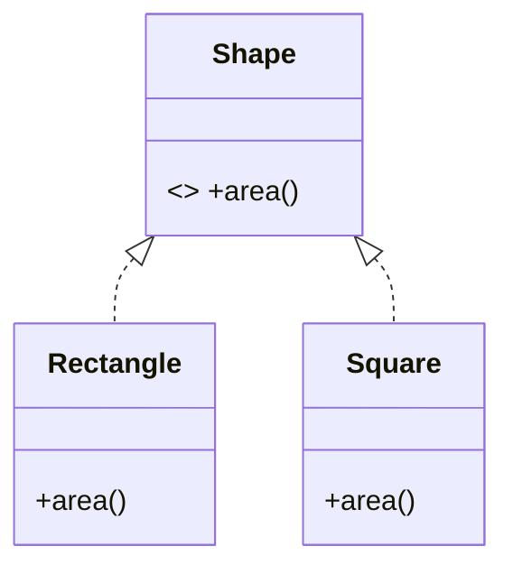

### `01_SOLID/lsp.md`

# Liskov Substitution Principle (LSP) - Nguyên lý Thay thế của Liskov

## Tổng quan
LSP phát biểu rằng: nếu S là một subtype của T, thì các đối tượng của T có thể được thay bằng các đối tượng của S mà không làm thay đổi tính đúng đắn của chương trình. Nói cách khác, subtype phải có thể thay thế cho supertype mà không gây lỗi hoặc thay đổi mong đợi.

## Dấu hiệu vi phạm
- Thay thế subtype khiến behavior khác (bất ngờ) hoặc ném exception khi supertype không làm.
- Subclass làm yếu điều kiện hậu (weaken postconditions) hoặc mạnh điều kiện tiền (strengthen preconditions).
- Subclass thay đổi hợp đồng của phương thức (side-effects, trả về giá trị khác kiểu/định nghĩa).

## Nguyên tắc thực hành
- Thiết kế interfaces/mô hình với contract rõ ràng (pre/post conditions, invariants).
- Tránh override phương thức làm thay đổi điều kiện hợp đồng.
- Sử dụng composition nếu subclass không thể bảo toàn hợp đồng.

## Ví dụ sai (vi phạm LSP) — Python
```python
class Rectangle:
	def __init__(self, w, h):
		self.w = w; self.h = h
	def set_width(self, w): self.w = w
	def set_height(self, h): self.h = h
	def area(self): return self.w * self.h

class Square(Rectangle):
	def __init__(self, size): super().__init__(size, size)
	def set_width(self, w): self.w = self.h = w
	def set_height(self, h): self.w = self.h = h

def use_rectangle(r: Rectangle):
	r.set_width(5)
	r.set_height(4)
	assert r.area() == 20

# Nếu truyền Square, area() == 25 -> vi phạm LSP
```

Giải pháp: tách `Rectangle` và `Square` không dùng kế thừa trực tiếp, hoặc sử dụng interface `Shape` với `area()` và constructors thích hợp.

## Ví dụ đúng (tuân LSP)
```python
from abc import ABC, abstractmethod

class Shape(ABC):
	@abstractmethod
	def area(self): pass

class Rectangle(Shape):
	def __init__(self, w, h): self.w=w; self.h=h
	def area(self): return self.w * self.h

class Square(Shape):
	def __init__(self, s): self.s=s
	def area(self): return self.s * self.s
```

## Checklist kiểm tra LSP
- [ ] Subclass có giữ nguyên hợp đồng của supertype không?
- [ ] Không tăng yêu cầu tiền điều kiện (preconditions)?
- [ ] Không giảm đảm bảo hậu điều kiện (postconditions)?
- [ ] Không phá vỡ invariants? 

## Lưu ý & trade-offs
- LSP là về hợp đồng — tài liệu và test hợp đồng là quan trọng.
- Khi không thể tuân LSP, dùng composition thay vì inheritance.

## UML (Mermaid)


---

Người soạn: ArchReview AI — LSP chi tiết.

