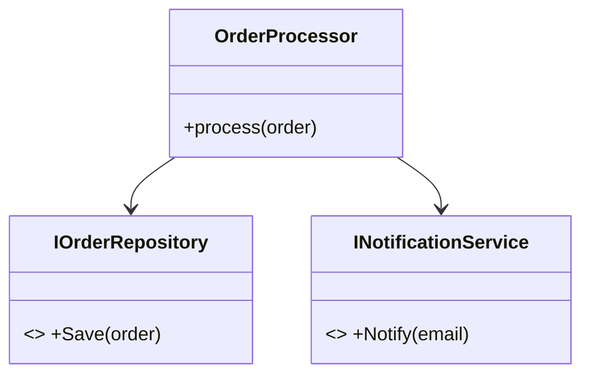

# Single Responsibility Principle (SRP) - Nguyên lý Đơn nhiệm

## Tổng quan
SRP phát biểu rằng: mỗi lớp (hoặc module) chỉ nên có một lý do để thay đổi — tức là chỉ chịu một trách nhiệm duy nhất. Áp dụng SRP giúp mã dễ hiểu, dễ test và dễ bảo trì.

## Dấu hiệu vi phạm (Code smells)
- **God Class**: lớp chứa nhiều trách nhiệm (ví dụ: xử lý logic, lưu trữ, gửi thông báo).
- **Divergent Change**: cùng một class thường xuyên bị sửa do nhiều loại thay đổi (UI, DB, business).
- High coupling, low cohesion, nhiều phương thức không liên quan.

## Cách refactor & hướng giải pháp
- Áp dụng **Extract Class / Extract Module** để tách trách nhiệm.
- Dùng Dependency Injection để ghép các class đơn nhiệm với nhau.
- Viết interface/abstraction cho mỗi trách nhiệm để dễ mock và test.

## Ví dụ — Sai (vi phạm SRP) — C#
```csharp
public class OrderProcessor
{
    public void ProcessOrder(Order order)
    {
        // Xử lý business
        order.IsProcessed = true;

        // Lưu DB
        using (var connection = new SqlConnection("ConnectionString"))
        {
            connection.Execute("INSERT INTO Orders ...", order);
        }

        // Gửi email
        var smtpClient = new SmtpClient("smtp.gmail.com");
        smtpClient.Send(new MailMessage("system@domain.com", order.CustomerEmail));
    }
}
```

Vấn đề: thay đổi cách gửi email hoặc thay đổi lưu DB đều bắt buộc sửa `OrderProcessor`.

## Ví dụ — Đúng (tuân SRP) — C# (tách responsibility)
```csharp
public interface IOrderRepository { void Save(Order order); }
public interface INotificationService { void Notify(string email); }

public class OrderProcessor
{
    private readonly IOrderRepository repo;
    private readonly INotificationService notify;

    public OrderProcessor(IOrderRepository repo, INotificationService notify)
    {
        this.repo = repo; this.notify = notify;
    }

    public void ProcessOrder(Order order)
    {
        order.IsProcessed = true;
        repo.Save(order);
        notify.Notify(order.CustomerEmail);
    }
}
```

## Ví dụ Python ngắn (SRP)
```python
class OrderRepository:
    def save(self, order): pass

class EmailService:
    def send(self, to, body): pass

class OrderProcessor:
    def __init__(self, repo, mailer):
        self.repo = repo
        self.mailer = mailer

    def process(self, order):
        order.processed = True
        self.repo.save(order)
        self.mailer.send(order.email, 'confirmed')
```

## Checklist kiểm tra SRP
- [ ] Lớp này chịu đúng 1 trách nhiệm?
- [ ] Có thể tách phần thay đổi sang class riêng không?
- [ ] Có thể mock từng phần khi viết unit test không?
- [ ] Thay đổi UI/DB/business có làm sửa class này không?

## Anti-patterns liên quan
- God Class, Anemic Domain Model (đôi khi cần cân nhắc), High coupling.

## Kiểm thử & Sử dụng
- Viết unit test riêng cho từng service/repository.
- Sử dụng DI container để cấu hình các implement khi chạy.

## UML (Mermaid)


---

Người soạn: ArchReview AI — SRP chi tiết.

