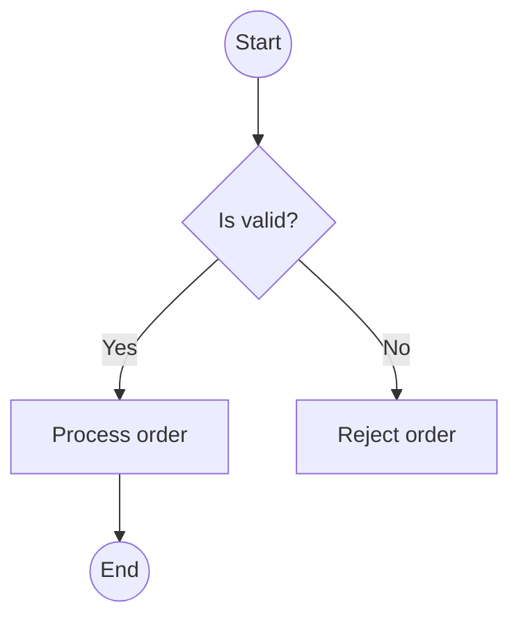

# Activity Diagram

## Mô tả
Activity diagram mô tả luồng công việc (workflow) hoặc flowchart có điều kiện, phân nhánh và concurrent flows.

## Khi nào dùng
- Mô tả business process hoặc luồng xử lý phức tạp.

## Mermaid example

## Checklist
- [ ] Hiển thị rõ điểm bắt đầu/kết thúc.
- [ ] Sử dụng decision nodes cho điều kiện.
- [ ] Ghi chú parallel flows khi cần.

---

Người soạn: ArchReview AI — Activity Diagram guide.