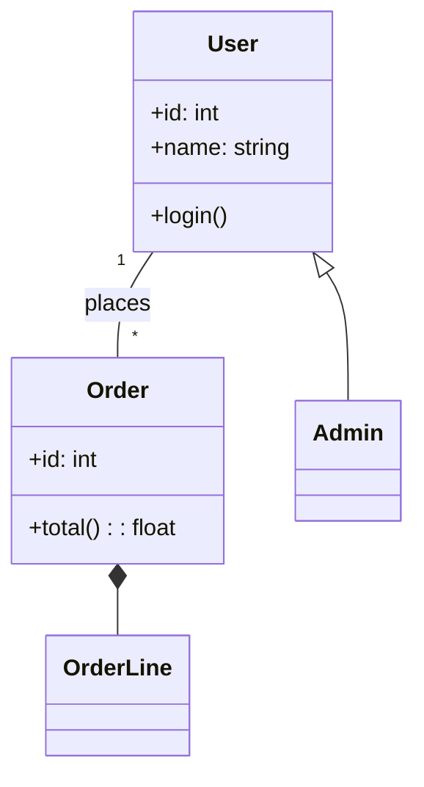

# Class Diagram

## Mô tả
Class diagram mô tả cấu trúc tĩnh của hệ thống: lớp, thuộc tính, phương thức và quan hệ (association, inheritance, aggregation, composition, dependency).

## Khi nào dùng
- Thiết kế domain model.
- Minh hoạ cấu trúc hệ thống và phụ thuộc giữa lớp.

## Thành phần chính
- Class (name, attributes, methods)
- Relationships: inheritance (<|--), association (--), aggregation (o--), composition (*--), dependency (<..)

## Mermaid example

## Checklist
- [ ] Đặt tên lớp/thuộc tính rõ ràng.
- [ ] Sử dụng composition khi mối quan hệ là sở hữu chặt chẽ.
- [ ] Dùng association cho mối quan hệ lỏng hơn.
- [ ] Tránh lặp lại thông tin; biểu diễn dependencies quan trọng.

---

Người soạn: ArchReview AI — Class Diagram guide.