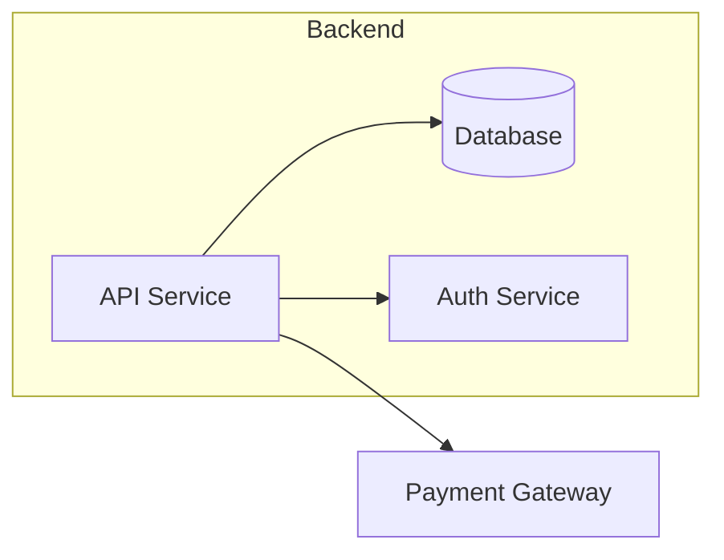

# Component Diagram

## Mô tả
Component diagram mô tả các thành phần (components) cấp cao và phụ thuộc giữa chúng: services, modules, external systems.

## Khi nào dùng
- Thiết kế kiến trúc module-level hoặc khi phân chia hệ thống thành services.

## Mermaid example

## Checklist
- [ ] Xác định các components chính và interfaces.
- [ ] Thể hiện dependencies rõ ràng.
- [ ] Ghi chú về deployment nếu cần (container, region).

---

Người soạn: ArchReview AI — Component Diagram guide.