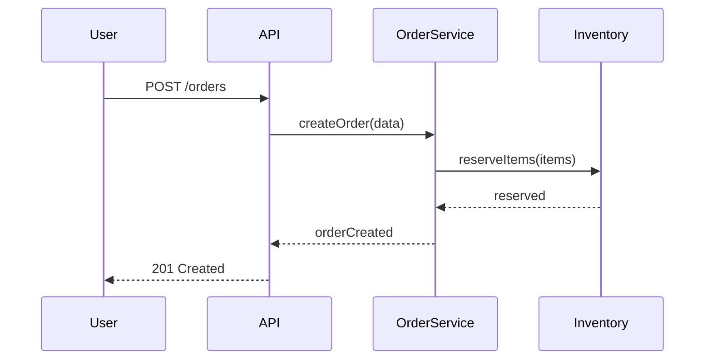

# Sequence Diagram

## Mô tả
Sequence diagram mô tả tương tác theo thời gian giữa các đối tượng/actor: message, call, return, lifeline.

## Khi nào dùng
- Thiết kế luồng xử lý use case hoặc tương tác giữa services.
- Mô tả orchestration và timing.

## Mermaid example

## Checklist
- [ ] Xác định actors và participants chính.
- [ ] Thể hiện rõ luồng messages và response.
- [ ] Ghi chú các điều kiện async hoặc lỗi.

---

Người soạn: ArchReview AI — Sequence Diagram guide.