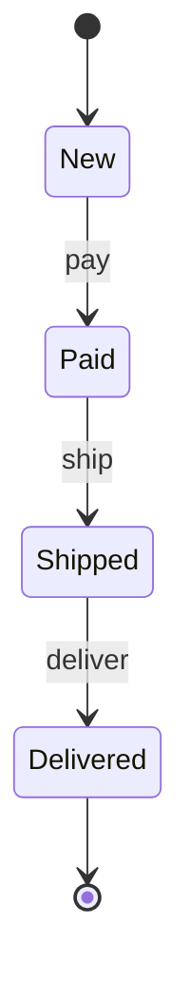

# State Diagram

## Mô tả
State diagram mô tả các trạng thái (states) của một entity và chuyển đổi giữa chúng theo các events.

## Khi nào dùng
- Mô tả vòng đời đối tượng (order lifecycle, document states).

## Mermaid example

## Checklist
- [ ] Liệt kê tất cả trạng thái hợp lệ của entity.
- [ ] Xác định sự kiện gây transition.
- [ ] Ghi chú hành vi entry/exit nếu cần.

---

Người soạn: ArchReview AI — State Diagram guide.